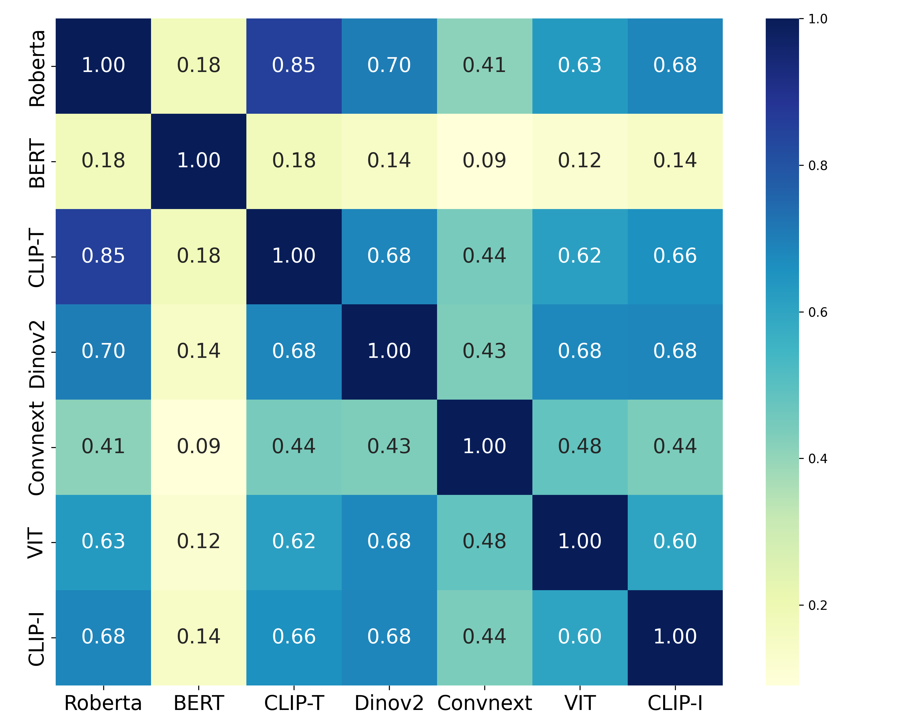
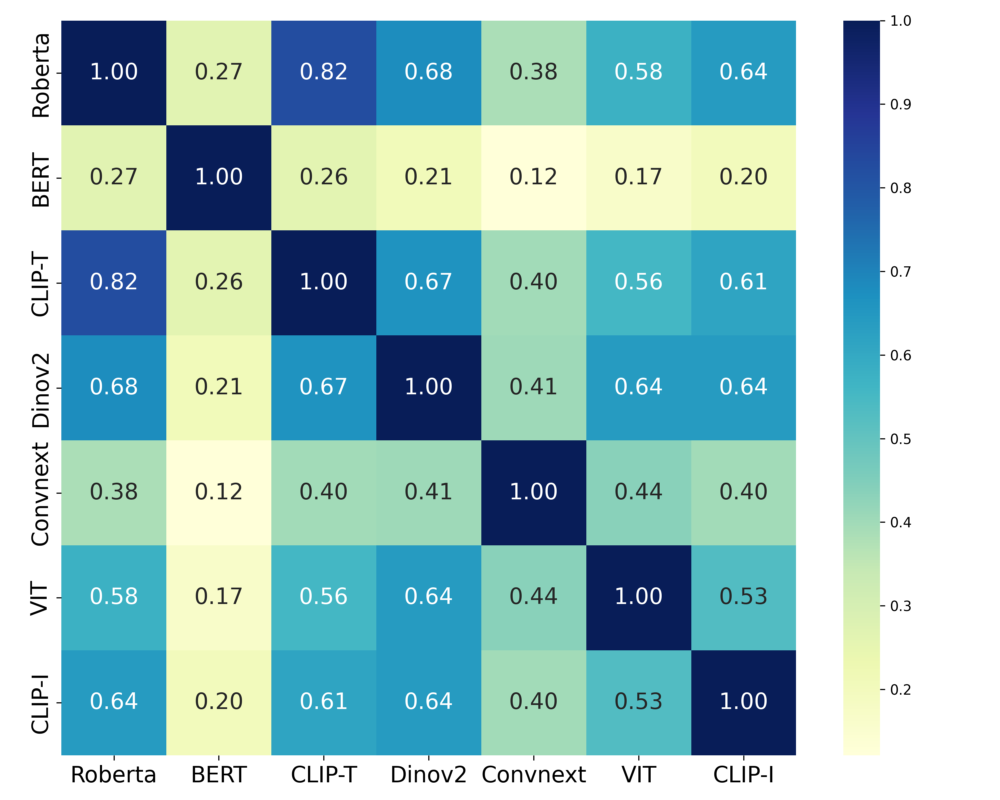

# Representation Potentials of Foundation Models for Multimodal Alignment: A Survey (EMNLP25)

This is the repository for the survery paper: [Representation Potentials of Foundation Models for Multimodal Alignment: A Survey](https://arxiv.org/abs/2510.05184). The collection will be continuously updated, so star (🌟) & stay tuned. Any suggestions and comments are welcome (jianglinlu@outlook.com). 

  
  

<b>Figure 1.</b> CKA scores between different models computed on MS-COCO and NOCAPS datasets.

## Contents
- [Foundation Models](#FM)
  - [Vision Foundation Models](#VFMs)
  - [Large Language Models](#LLMs)
  - [Speech Foundation Models](#SFMs)
  - [Multimodal Foundation Models](#MFMs)
- [Alignment Metrics](#ALME)
- [Representation Potentials of Foundation Models for Alignment](#RCSM)
  - [Representation Alignment in Vision](#RCSMV)
  - [Representation Alignment in Language](#RCSML)
  - [Representation Alignment in Speech](#RCSMS)
  - [Representation Alignment Across Modalities](#RCAM)
  - [Representation Alignment with Neuroscience](#RCBS)
- [Factors Driving Representation Potential for  Alignment](#Facts)

<a name="FM" />

## Foundation Models [[Back to Top]](#)

1. **On the Opportunities and Risks of Foundation Models** *Rishi Bommasani et al, arXiv 2022.* [[PDF]](https://arxiv.org/pdf/2108.07258)

<a name="VFMs" />

### Vision Foundation Models

1. **Deep Residual Learning for Image Recognition** * Kaiming He et al, CVPR 2016.*  [[PDF]](https://ieeexplore.ieee.org/stamp/stamp.jsp?arnumber=7780459) 

1. **An Image is Worth 16x16 Words: Transformers for Image Recognition at Scale** *Alexey Dosovitskiy et al, ICLR 2021.*  [[PDF]](https://arxiv.org/pdf/2010.11929/1000)

1. **A ConvNet for the 2020s** *Zhuang Liu et al, CVPR 2022.*  [[PDF]](https://openaccess.thecvf.com/content/CVPR2022/papers/Liu_A_ConvNet_for_the_2020s_CVPR_2022_paper.pdf) 

1. **ConvNeXt V2: Co-Designing and Scaling ConvNets With Masked Autoencoders** *Sanghyun Woo et al, CVPR 2023.*  [[PDF]](https://openaccess.thecvf.com/content/CVPR2023/papers/Woo_ConvNeXt_V2_Co-Designing_and_Scaling_ConvNets_With_Masked_Autoencoders_CVPR_2023_paper.pdf) 

1. **DINOv2: Learning Robust Visual Features without Supervision** *Maxime Oquab et al, arXiv 2024.*  [[PDF]](https://arxiv.org/pdf/2304.07193) 

1. **DINOv3.** *Oriane Siméoni et al, arXiv 2025.*  [[PDF]](https://arxiv.org/pdf/2508.10104) 

1. **Segment Anything** *Alexander Kirillov et al, ICCV 2023.*  [[PDF]](https://arxiv.org/pdf/2304.02643) 

<a name="LLMs" />

### Large Language Models

1. **Language Models are Few-Shot Learners** *Tom B. Brown et al, NeurIPS 2020.*  [[PDF]](https://arxiv.org/pdf/2005.14165)

1. **Scaling Laws for Neural Language Models** *Jared Kaplan et al, arXiv 2020.*  [[PDF]](https://arxiv.org/pdf/2001.08361)

1. **BERT: Pre-training of Deep Bidirectional Transformers for Language Understanding** *Jacob Devlin et al, NAACL 2019.*  [[PDF]](https://aclanthology.org/N19-1423.pdf) 

1. **Exploring the Limits of Transfer Learning with a Unified Text-to-Text Transformer** *Colin Raffel et al, JMLR 2020.*  [[PDF]](https://arxiv.org/pdf/1910.10683)

1. **Emergent Abilities of Large Language Models** *Jason Wei et al, TMLR 2022.*  [[PDF]](https://openreview.net/pdf?id=yzkSU5zdwD) 

1. **Qwen Technical Report** *Jinze Bai et al, arXiv 2023.*  [[PDF]](https://arxiv.org/pdf/2309.16609)

1. **The Llama 3 Herd of Models** *Aaron Grattafiori et al, arXiv 2024.*  [[PDF]](https://arxiv.org/pdf/2407.21783) 

<a name="SFMs" />

### Speech Foundation Models

1. **wav2vec: Unsupervised Pre-training for Speech Recognition** *Steffen Schneider et al, arXiv 2019.*  [[PDF]](https://arxiv.org/pdf/1904.05862)

1. **wav2vec 2.0: A Framework for Self-Supervised Learning of Speech Representations** *Alexei Baevski et al, NeurIPS 2020.*  [[PDF]](https://proceedings.neurips.cc/paper/2020/file/92d1e1eb1cd6f9fba3227870bb6d7f07-Paper.pdf)

1. **HuBERT: Self-Supervised Speech Representation Learning by Masked Prediction of Hidden Units** *Wei-Ning Hsu et al, arXiv 2021.*  [[PDF]](https://arxiv.org/pdf/2106.07447)

1. **WavLM: Large-Scale Self-Supervised Pre-Training for Full Stack Speech Processing** *Sanyuan Chen et al, arXiv 2022.*  [[PDF]](https://arxiv.org/pdf/2110.13900)

1. **Robust Speech Recognition via Large-Scale Weak Supervision** *Alec Radford et al, ICML 2023.*  [[PDF]](https://proceedings.mlr.press/v202/radford23a/radford23a.pdf)

1. **SeamlessM4T: Massively Multilingual & Multimodal Machine Translation** *Seamless Communication et al, arXiv 2023.*  [[PDF]](https://arxiv.org/pdf/2308.11596) 

<a name="MFMs" />

### Multimodal Foundation Models

1. **Learning Transferable Visual Models From Natural Language Supervision** *Alec Radford, et al, ICML 2021.*  [[PDF]](https://proceedings.mlr.press/v139/radford21a/radford21a.pdf) 

1. **Scaling Up Visual and Vision-Language Representation Learning With Noisy Text Supervision** *Chao Jia et al, ICML 2021.*  [[PDF]](https://arxiv.org/pdf/2102.05918) 

1. **Blip: Bootstrapping language-image pretraining for unified vision-language understanding and generation.** *Junnan Li et al, ICML 2022.*  [[PDF]](https://arxiv.org/pdf/2201.12086) 

1. **Coca: Contrastive captioners are image-text foundation models.** *Jiahui Yu et al, arXiv 2022.*  [[PDF]](https://arxiv.org/pdf/2205.01917) 

1. **Flamingo: a visual language model for few-shot learning.** *Jean-Baptiste Alayrac et al, NeurIPS 2022.*  [[PDF]](https://arxiv.org/pdf/2204.14198) 

1. **PaLI: A Jointly-Scaled Multilingual Language-Image Model.** *Xi Chen et al, ICLR 2023.*  [[PDF]](https://arxiv.org/pdf/2209.06794) 

1. **GPT-4 Technical Report.** *OpenAI, arXiv 2023.*  [[PDF]](https://arxiv.org/pdf/2303.08774) 

1. **Gemini: A Family of Highly Capable Multimodal Models.** *Gemini Team, arXiv 2023.*  [[PDF]](https://arxiv.org/pdf/2312.11805) 

1. **A Survey on Multimodal Large Language Models.** *Shukang Yin et al, National Science Review 2024.*  [[PDF]](https://arxiv.org/pdf/2306.13549) 

<a name="ALME" />

## Alignment Metrics [[Back to Top]](#)

1. **Supervised Feature Selection via Dependence Estimation.** *Le Song et al, ICML 2007.*  [[PDF]](https://arxiv.org/pdf/0704.2668) 

1. **SVCCA: Singular Vector Canonical Correlation Analysis for Deep Learning Dynamics and Interpretability.** *Maithra Raghu et al, NIPS 2017.*  [[PDF]](https://arxiv.org/pdf/1706.05806) 

1. **Representational models: A common framework for understanding encoding, pattern-component, and representational-similarity analysis.** *Jörn Diedrichsen et al, PLoS computational biology 2017.*  [[PDF]](https://journals.plos.org/ploscompbiol/article?id=10.1371/journal.pcbi.1005508) 

1. **Insights on Representational Similarity in Neural Networks with Canonical Correlation.** *Ari S. Morcos et al, NeurIPS 2018.*  [[PDF]](https://dl.acm.org/doi/pdf/10.5555/3327345.3327475) 

1. **Towards Understanding Learning Representations: To What Extent Do Different Neural Networks Learn the Same Representation.** *Liwei Wang et al, NeurIPS 2018.*  [[PDF]](https://arxiv.org/pdf/1810.11750) 

1. **Batch effects in single-cell RNA-sequencing data are corrected by matching mutual nearest neighbors.** *Laleh Haghverdi et al, Nature Biotechnology 2018.*  [[PDF]](https://www.nature.com/articles/nbt.4091.pdf) 

1. **Similarity of Neural Network Representations Revisited** *Simon Kornblith. et al, ICML 2019.*  [[PDF]](https://proceedings.mlr.press/v97/kornblith19a/kornblith19a.pdf) 

1. **On the Cross-lingual Transferability of Monolingual Representations.** *Mikel Artetxe et al, ACL 2020.*  [[PDF]](https://arxiv.org/pdf/1910.11856) 

1. **Towards Understanding the Instability of Network Embedding.** *Chenxu Wang et al, TKDE 2020.*  [[PDF]](https://ieeexplore.ieee.org/stamp/stamp.jsp?tp=&arnumber=9076342) 

1. **Do Wide and Deep Networks Learn the Same Things? Uncovering How Neural Network Representations Vary with Width and Depth.** *Thao Nguyen et al, ICLR 2021.*  [[PDF]](https://openreview.net/pdf?id=KJNcAkY8tY4) 

1. **Using distance on the Riemannian manifold to compare representations in brain and in models.** *Mahdiyar Shahbazi et al, NeuroImage 2021.*  [[PDF]](https://www.sciencedirect.com/science/article/pii/S1053811921005474) 

1. **Reliability of CKA as a Similarity Measure in Deep Learning.** *MohammadReza Davari et al, ICLR 2023.*  [[PDF]](https://openreview.net/pdf?id=8HRvyxc606) 

1. **Understanding the Inner Workings of Language Models Through Representation Dissimilarity.** *Davis Brown et al, EMNLP 2023.*  [[PDF]](https://arxiv.org/pdf/2310.14993) 

1. **What Representational Similarity Measures Imply about Decodable Information.** *Sarah E. Harvey et al, arXiv 2024.*  [[PDF]](https://arxiv.org/pdf/2411.08197) 

1. **Similarity of Neural Network Models: A Survey of Functional and Representational Measures.** *Max Klabunde et al, arXiv 2025.*  [[PDF]](https://arxiv.org/pdf/2305.06329) 

<a name="RCSM" />

## Representation Potentials of Foundation Models for Alignment [[Back to Top]](#)

<a name="RCSMV" />

### Representation Alignment in Vision

1. **Understanding Image Representations by Measuring Their Equivariance and Equivalence.** *Karel Lenc et al, CVPR 2015.*  [[PDF]](https://www.cv-foundation.org/openaccess/content_cvpr_2015/papers/Lenc_Understanding_Image_Representations_2015_CVPR_paper.pdf) 

1. **Convergent Learning: Do different neural networks learn the same representations?** *Yixuan Li et al, ICLR 2016.*  [[PDF]](https://arxiv.org/pdf/1511.07543) 

1. **SVCCA: Singular Vector Canonical Correlation Analysis for Deep Learning Dynamics and Interpretability.** *Maithra Raghu et al, NIPS 2017.*  [[PDF]](https://arxiv.org/pdf/1706.05806) 

1. **A Spline Theory of Deep Learning.** *Randall Balestriero et al, ICML 2018.*  [[PDF]](https://proceedings.mlr.press/v80/balestriero18b/balestriero18b.pdf) 

1. **Insights on Representational Similarity in Neural Networks with Canonical Correlation.** *Ari S. Morcos et al, NeurIPS 2018.*  [[PDF]](https://dl.acm.org/doi/pdf/10.5555/3327345.3327475) 

1. **Similarity of Neural Network Representations Revisited** *Simon Kornblith. et al, ICML 2019.*  [[PDF]](https://proceedings.mlr.press/v97/kornblith19a/kornblith19a.pdf) 

1. **Similarity and Matching of Neural Network Representations.** *Adrián Csiszárik et al, NeurIPS 2021.*  [[PDF]](https://openreview.net/pdf?id=aedFIIRRfXr) 

1. **On Linear Identifiability of Learned Representations.** *Geoffrey Roeder et al, ICML 2021.*  [[PDF]](https://proceedings.mlr.press/v139/roeder21a/roeder21a.pdf) 

1. **Do Self-Supervised and Supervised Methods Learn Similar Visual Representations?** *Tom George Grigg et al, arXiv 2021.*  [[PDF]](https://arxiv.org/pdf/2110.00528) 

1. **Revisiting Model Stitching to Compare Neural Representations.** *Yamini Bansal et al, NeurIPS 2021.*  [[PDF]](https://arxiv.org/pdf/2106.07682) 

1. **Emerging Properties in Self-Supervised Vision Transformers.** *Mathilde Caron et al, ICCV 2021.*  [[PDF]](https://openaccess.thecvf.com/content/ICCV2021/papers/Caron_Emerging_Properties_in_Self-Supervised_Vision_Transformers_ICCV_2021_paper.pdf) 

1. **Do Vision Transformers See Like Convolutional Neural Networks?** *Maithra Raghu et al, NeurIPS 2021.*  [[PDF]](https://arxiv.org/pdf/2108.08810) 

1. **Relative Representations Enable Zero-Shot Latent Space Communication.** *Luca Moschella et al, ICLR 2023.*  [[PDF]](https://arxiv.org/pdf/2209.15430) 

1. **Objectives Matter: Understanding the Impact of Self-Supervised Objectives on Vision Transformer Representations.** *Shashank Shekhar et al, arXiv 2023.*  [[PDF]](https://arxiv.org/pdf/2304.13089) 

1. **Rosetta Neurons: Mining the Common Units in a Model Zoo.** *Amil Dravid et al, ICCV 2023.*  [[PDF]](https://arxiv.org/pdf/2306.09346) 

1. **DINOv2: Learning Robust Visual Features without Supervision.** *Maxime Oquab et al, TMLR 2024.*  [[PDF]](https://arxiv.org/pdf/2304.07193) 

1. **ZipIt! Merging Models from Different Tasks without Training.** *George Stoica et al, ICLR 2024.*  [[PDF]](https://arxiv.org/pdf/2305.03053) 

1. **The Platonic Representation Hypothesis.** *Minyoung Huh et al, ICML 2024.*  [[PDF]](https://arxiv.org/pdf/2405.07987) 

1. **How Do the Architecture and Optimizer Affect Representation Learning? On the Training Dynamics of Representations in Deep Neural Networks.** *Yuval Sharon et al, arXiv 2025.*  [[PDF]](https://arxiv.org/pdf/2405.17377) 

1. **Dual Diffusion for Unified Image Generation and Understanding.** *Zijie Li et al, CVPR 2025.*  [[PDF]](https://openaccess.thecvf.com/content/CVPR2025/papers/Li_Dual_Diffusion_for_Unified_Image_Generation_and_Understanding_CVPR_2025_paper.pdf) 

1. **Representation Alignment for Generation: Training Diffusion Transformers Is Easier Than You Think.** *Sihyun Yu et al, ICLR 2025.*  [[PDF]](https://arxiv.org/pdf/2410.06940) 

<a name="RCSML" />

### Representation Alignment in Language

1. **Fine-Tuned Transformers Show Clusters of Similar Representations Across Layers.** *Jason Phang et al, arXiv 2021.*  [[PDF]](https://aclanthology.org/2021.blackboxnlp-1.42.pdf) 

1. **Tracing Representation Progression: Analyzing and Enhancing Layer-Wise Similarity.** *Jiachen Jiang et al, ICLR 2025.*  [[PDF]](https://openreview.net/pdf?id=vVxeFSR4fU) 

1. **The Linear Representation Hypothesis and the Geometry of Large Language Models.** *Kiho Park et al, ICML 2024.*  [[PDF]](https://arxiv.org/pdf/2311.03658) 

1. **Quantifying Feature Space Universality Across Large Language Models via Sparse Autoencoders.** *Michael Lan et al, arXiv 2024.*  [[PDF]](https://arxiv.org/pdf/2410.06981) 

1. **Truth is Universal: Robust Detection of Lies in LLMs.** *Lennart Bürger et al, NeurIPS 2024.*  [[PDF]](https://arxiv.org/pdf/2407.12831) 

1. **Analyzing the Generalization and Reliability of Steering Vectors.** *Daniel Tan et al, NeurIPS 2024.*  [[PDF]](https://arxiv.org/pdf/2407.12404) 

1. **Cross-lingual Similarity of Multilingual Representations Revisited.** *Maksym Del et al, arXiv 2022.*  [[PDF]](https://arxiv.org/pdf/2212.01924) 

1. **Universal Neurons in GPT2 Language Models.** *Wes Gurnee et al, arXiv 2024.*  [[PDF]](https://arxiv.org/pdf/2401.12181) 

1. **Activation Space Interventions Can Be Transferred Between Large Language Models.** *Narmeen Oozeer et al, ICML 2025.*  [[PDF]](https://arxiv.org/pdf/2503.04429) 

1. **Transferring Features Across Language Models With Model Stitching.** *Alan Chen et al, arXiv 2025.*  [[PDF]](https://www.arxiv.org/pdf/2506.06609) 

1. **Update Your Transformer to the Latest Release: Re-Basin of Task Vectors.** *Filippo Rinaldi et al, ICML 2025.*  [[PDF]](https://arxiv.org/pdf/2505.22697) 

1. **Shared Global and Local Geometry of Language Model Embeddings.** *Andrew Lee et al, COLM 2025.*  [[PDF]](https://arxiv.org/pdf/2503.21073) 

1. **Towards Universality: Studying Mechanistic Similarity Across Language Model Architectures.** *Junxuan Wang et al, ICLR 2025.*  [[PDF]](https://openreview.net/pdf?id=2J18i8T0oI) 

1. **Emergence of a High-Dimensional Abstraction Phase in Language Transformers.** *Emily Cheng et al, ICLR 2025.*  [[PDF]](https://openreview.net/pdf?id=0fD3iIBhlV) 

<a name="RCSMS" />

### Representation Alignment in Speech

1. **Insights on Neural Representations for End-to-End Speech Recognition.** *Anna Ollerenshaw et al, Interspeech 2021.*  [[PDF]](https://arxiv.org/pdf/2205.09456) 

1. **Similarity Analysis of Self-Supervised Speech Representations.** *Yu-An Chung et al, ICASSP 2021.*  [[PDF]](https://arxiv.org/pdf/2010.11481) 

1. **Comparative Layer-Wise Analysis of Self-Supervised Speech Models.** *Ankita Pasad et al, ICASSP 2023.*  [[PDF]](https://arxiv.org/pdf/2211.03929) 

1. **What Do Self-Supervised Speech Models Know About Words?.** *Ankita Pasad et al, arXiv 2024.*  [[PDF]](https://arxiv.org/pdf/2307.00162) 

1. **What Do Speech Foundation Models Not Learn About Speech?** *Abdul Waheed et al, arXiv 2024.*  [[PDF]](https://arxiv.org/pdf/2410.12948) 

1. **How Redundant Is the Transformer Stack in Speech Representation Models?** *Teresa Dorszewski et al, ICASSP 2025.*  [[PDF]](https://arxiv.org/pdf/2409.16302) 

1. **Iterative refinement, not training objective, makes HuBERT behave differently from wav2vec 2.0.** *Robin Huo et al, Interspeech 2025.*  [[PDF]](https://arxiv.org/pdf/2508.08110) 

<a name="RCAM" />

### Representation Alignment Across Modalities [[Back to Top]](#)

1. **Linearly Mapping from Image to Text Space.** *Jack Merullo et al, ICLR 2023.*  [[PDF]](https://arxiv.org/pdf/2209.15162) 

1. **Grounding Language Models to Images for Multimodal Inputs and Outputs.** *Jing Yu Koh et al, ICML 2023.*  [[PDF]](https://arxiv.org/pdf/2301.13823) 

1. **Do Vision and Language Encoders Represent the World Similarly?** *Mayug Maniparambil et al, CVPR 2024.*  [[PDF]](https://openaccess.thecvf.com/content/CVPR2024/papers/Maniparambil_Do_Vision_and_Language_Encoders_Represent_the_World_Similarly_CVPR_2024_paper.pdf) 

1. **What Do Language Models Hear? Probing for Auditory Representations in Language Models.** *Jerry Ngo et al, ACL 2024.*  [[PDF]](https://arxiv.org/pdf/2402.16998) 

1. **How do Multimodal Foundation Models Encode Text and Speech? An Analysis of Cross-Lingual and Cross-Modal Representations.** *Hyunji Lee et al, arXiv 2024.*  [[PDF]](https://arxiv.org/pdf/2411.17666) 

1. **The Platonic Representation Hypothesis.** *Minyoung Huh et al, ICML 2024.*  [[PDF]](https://arxiv.org/pdf/2405.07987) 

1. **Assessing and Learning Alignment of Unimodal Vision and Language Models.** *Le Zhang et al, CVPR 2025.*  [[PDF]](https://openaccess.thecvf.com/content/CVPR2025/papers/Zhang_Assessing_and_Learning_Alignment_of_Unimodal_Vision_and_Language_Models_CVPR_2025_paper.pdf) 

1. **The Indra Representation Hypothesis.** *Jianglin Lu et al, NeurIPS 2025.*  [[PDF]](https://neurips.cc/virtual/2025/poster/119249)

<a name="RCBS" />

### Representation Alignment with Neuroscience [[Back to Top]](#)

1. **Evaluation of the Hierarchical Correspondence between the Human Brain and Artificial Neural Networks: A Review.** *Trung Quang Pham et al, Biology, 2023.*  [[PDF]](https://www.mdpi.com/2079-7737/12/10/1330) 

1. **Do Self-Supervised Speech and Language Models Extract Similar Representations as Human Brain?.** *Peili Chen et al, ICASSP, 2024.*  [[PDF]](https://arxiv.org/pdf/2310.04645) 

1. **Privileged representational axes in biological and artificial neural networks.** *Meenakshi Khosla et al, bioRxiv, 2024.*  [[PDF]](https://www.biorxiv.org/content/10.1101/2024.06.20.599957v1.abstract) 

1. **Universality of representation in biological and artificial neural networks.** *Eghbal Hosseini et al, bioRxiv 2024 .*  [[PDF]](https://www.biorxiv.org/content/10.1101/2024.12.26.629294v1.full.pdf) 

1. **High-level visual representations in the human brain are aligned with large language models.** *Adrien Doerig et al, Nature Machine Intelligence 2025.*  [[PDF]](https://www.nature.com/articles/s42256-025-01072-0.pdf) 

1. **Disentangling the Factors of Convergence between Brains and Computer Vision Models.** *Joséphine Raugel et al, arXiv 2025.*  [[PDF]](https://arxiv.org/pdf/2508.18226) 

1. **Brain-Model Evaluations Need the NeuroAI Turing Test.** *Jenelle Feather et al, arXiv 2025.*  [[PDF]](https://arxiv.org/pdf/2502.16238) 

<a name="Facts" />

## Factors Driving Representation Potential for  Alignment

1. **Scaling Laws for Neural Language Models.** *Jared Kaplan et al, arXiv 2020.*  [[PDF]](https://arxiv.org/pdf/2001.08361) 

1. **Inductive Biases and Variable Creation in Self-Attention Mechanisms.** *Benjamin L. Edelman et al, ICML 2022.*  [[PDF]](https://proceedings.mlr.press/v162/edelman22a/edelman22a.pdf) 

1. **Multitask Prompted Training Enables Zero-Shot Task Generalization.** *Victor Sanh et al, ICLR 2022.*  [[PDF]](https://openreview.net/pdf?id=9Vrb9D0WI4) 

1. **Simplicity Bias in Transformers and their Ability to Learn Sparse Boolean Functions.** *Satwik Bhattamishra et al, ACL 2023.*  [[PDF]](https://aclanthology.org/2023.acl-long.317.pdf) 

1. **Large language models converge toward human-like concept organization.** *Mathias Lykke Gammelgaard et al, arXiv 2023.*  [[PDF]](https://arxiv.org/pdf/2308.15047) 

1. **Multilingual Diversity Improves Vision-Language Representations.** *Thao Nguyen et al, NeurIPS 2024.*  [[PDF]](https://openreview.net/pdf?id=1WtEqReCyS) 

1. **Scaling Instruction-Finetuned Language Models.** *Hyung Won Chung et al, JMLR 2024.*  [[PDF]](https://jmlr.org/papers/volume25/23-0870/23-0870.pdf) 

1. **Instruction Diversity Drives Generalization To Unseen Tasks.** *Dylan Zhang et al, arXiv 2024.*  [[PDF]](https://arxiv.org/pdf/2402.10891) 

1. **Objective drives the consistency of representational similarity across datasets.** *Laure Ciernik et al, ICML 2025.*  [[PDF]](https://arxiv.org/pdf/2411.05561) 

1. **Relational reasoning and inductive bias in transformers trained on a transitive inference task.** *Jesse Geerts et al, arXiv 2025.*  [[PDF]](https://www.arxiv.org/pdf/2506.04289) 

1. **Updating.** * et al, .*  [[PDF]]() 

## 📝 Citation

If you find our survey useful, please consider citing:

    @inproceedings{lu2025representation,
      title={Representation Potentials of Foundation Models for Multimodal Alignment: A Survey},
      author={Lu, Jianglin and Wang, Hailing and Xu, Yi and Wang, Yizhou and Yang, Kuo and Fu, Yun},
      booktitle={Proceedings of the 2025 Conference on Empirical Methods in Natural Language Processing},
      year={2025}
    }

    @inproceedings{Jianglin2025,
      title={The Indra Representation Hypothesis},
      author={Lu, Jianglin and Wang, Hailing and Yang, Kuo and Zhang, Yitian and Jenni, Simon and Fu, Yun},
      booktitle={Advances in Neural Information Processing Systems},
      year={2025}
    }
